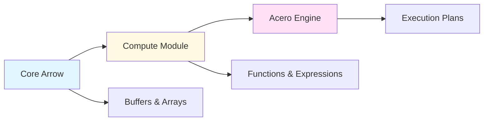
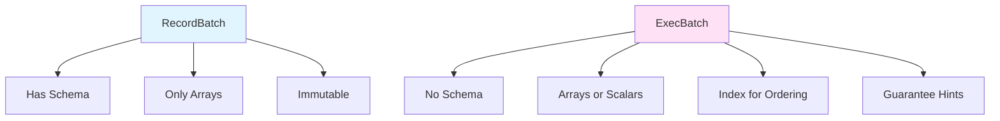
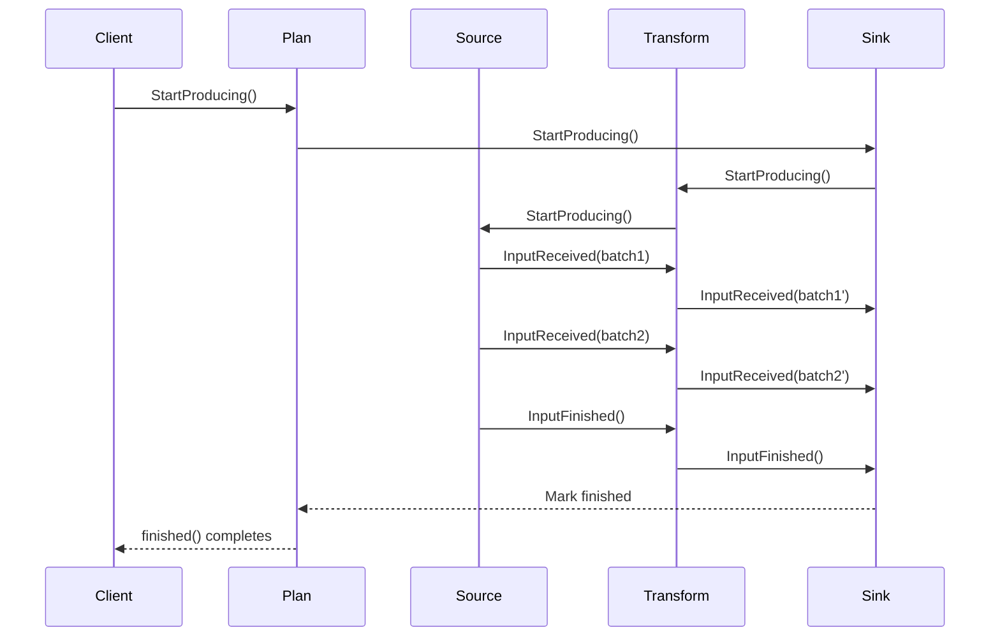
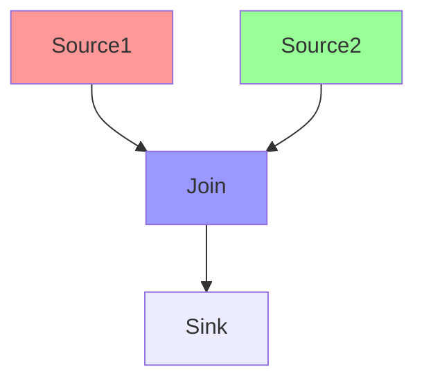
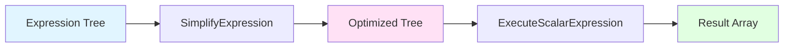

## Overview

Acero is Apache Arrow's streaming query execution engine designed for processing large (potentially infinite) data streams. Unlike the compute module which operates on in-memory data, Acero provides a dataflow execution model with pipelined processing and backpressure control.

<Info>
**Acero is experimental** - The API is still evolving. While the engine is production-ready for many use cases, breaking changes may occur in future releases.
</Info>

## Architectural Position

Acero sits as the top layer in Arrow's computational stack:



- **Core Arrow**: Buffers, arrays, types (no data transformation)
- **Compute Module**: Scalar and aggregate functions on in-memory data
- **Acero**: Streaming execution plans combining compute operations

### Acero vs. Compute Module

| Aspect | Compute Module | Acero |
|--------|---------------|-------|
| **Input** | Complete arrays in memory | Streams of batches |
| **Processing** | Single function call | Graph of operators |
| **Memory** | All data loaded | Bounded memory usage |
| **Execution** | Synchronous | Asynchronous/pipelined |
| **Use case** | Fast in-memory operations | Large dataset processing |

```cpp
// Compute Module: Operate on complete data
Result<Datum> result = compute::CallFunction(
    "add", {array1, array2}, &exec_context);

// Acero: Stream through execution plan
Declaration plan = Declaration::Sequence({
  {"table_source", TableSourceNodeOptions{table}},
  {"project", ProjectNodeOptions{{add_expression}}},
  {"table_sink", TableSinkNodeOptions{&output_table}}
});
AWAIT_READY(DeclarationToTable(plan));
```

## Core Concepts

### ExecBatch

The fundamental unit of data flow in Acero:

```cpp
// From cpp/src/arrow/compute/exec.h
struct ExecBatch {
  // Column data: Array or Scalar
  std::vector<Datum> values;
  
  // Number of rows (semantic length)
  int64_t length = 0;
  
  // Ordering information
  std::optional<int64_t> index;
  
  // Guarantee information
  struct Guarantee {
    bool all_valid = false;  // No nulls
    bool all_same = false;   // All values identical
  };
  std::vector<Guarantee> guarantee;
};
```

**Key differences from RecordBatch:**



1. **No schema**: Schema is stored at the node level (all batches in a stream share one schema)
2. **Scalar columns**: A `Scalar` represents a constant value across all rows
3. **Batch index**: Tracks position in ordered streams
4. **Guarantees**: Optimization hints (e.g., "this column has no nulls")

**Scalar vs Array columns:**

```cpp
// These four ExecBatch representations are semantically equivalent:

// Option 1: All arrays
ExecBatch{.values = {Array[1,2,3], Array[10,10,10]}, .length = 3}

// Option 2: Mixed (constant value as scalar)
ExecBatch{.values = {Array[1,2,3], Scalar(10)}, .length = 3}

// Option 3: All scalars
ExecBatch{.values = {Scalar(1), Scalar(10)}, .length = 3}

// Option 4: Different constant
ExecBatch{.values = {Array[1,2,3], Scalar(5)}, .length = 3}
// This is semantically: [(1,5), (2,5), (3,5)]
```

<Note>
**Design Rationale**: Scalar columns avoid materializing constant values, saving memory and computation. For example, a computed constant in a projection can remain as a scalar through subsequent operations.
</Note>

### ExecNode

The building blocks of execution plans:

```cpp
// From cpp/src/arrow/acero/exec_plan.h
class ExecNode {
public:
  virtual ~ExecNode() = default;
  
  // Node identification
  virtual const char* kind_name() const = 0;
  const std::string& label() const { return label_; }
  
  // Graph structure
  const NodeVector& inputs() const { return inputs_; }
  const ExecNode* output() const { return output_; }
  
  // Data schema
  const std::shared_ptr<Schema>& output_schema() const;
  
  // Ordering guarantees
  const Ordering& ordering() const;
  
  // Lifecycle
  virtual Status Validate() const;
  virtual void StartProducing() = 0;
  virtual void StopProducing() = 0;
  
  // Data flow (push-based)
  virtual void InputReceived(ExecNode* input, ExecBatch batch) = 0;
  virtual void InputFinished(ExecNode* input, int total_batches) = 0;
  
 protected:
  ExecPlan* plan_;
  NodeVector inputs_;
  ExecNode* output_;
  std::shared_ptr<Schema> output_schema_;
  std::string label_;
};
```

**Node types:**

- **Source nodes** (0 inputs): Generate or read data
  - `table_source`: Emit batches from in-memory table
  - `scan`: Read from dataset/files
  
- **Transform nodes** (1+ inputs, 1 output): Modify data
  - `project`: Compute new columns
  - `filter`: Remove rows
  - `aggregate`: Compute summaries
  - `join`: Combine streams
  
- **Sink nodes** (1+ inputs, 0 outputs): Consume data
  - `table_sink`: Accumulate into table
  - `write`: Write to files
  - `consuming_sink`: Custom callback

<Info>
**Push-based execution**: Acero uses a push model where source nodes push data downstream through `InputReceived()` calls. This enables efficient pipelining and backpressure control.
</Info>

### ExecPlan

A graph of connected nodes representing a complete query:

```cpp
class ExecPlan {
public:
  // Maximum batch size (allows 16-bit indices)
  static const uint32_t kMaxBatchSize = 1 << 15;  // 32768 rows
  
  // Create empty plan
  static Result<std::shared_ptr<ExecPlan>> Make(
      ExecContext exec_context = *threaded_exec_context());
  
  // Add nodes
  ExecNode* AddNode(std::unique_ptr<ExecNode> node);
  
  template <typename Node, typename... Args>
  Node* EmplaceNode(Args&&... args);
  
  // Execution control
  void StartProducing();  // Begin execution
  void StopProducing();   // Request stop
  Future<> finished();    // Wait for completion
  
  // Introspection
  const NodeVector& nodes() const;
  std::string ToString() const;
};
```

**Execution lifecycle:**



<Note>
**Startup order**: Nodes start in reverse topological order (sinks first, sources last). This ensures backpressure paths are established before data flows.
</Note>

### Declaration

The public API for building execution plans:

```cpp
// A Declaration is a blueprint for an ExecNode
struct Declaration {
  std::string factory_name;  // Node type (e.g., "filter")
  std::vector<Declaration> inputs;  // Input declarations
  std::shared_ptr<ExecNodeOptions> options;  // Node configuration
  std::string label;  // Optional debug label
};

// Example: Project node declaration
Declaration project_decl{
  "project",
  {source_decl},  // Input
  ProjectNodeOptions{
    {compute::field_ref("x"), compute::field_ref("y")}
  }
};
```

**Why Declarations?**

- **Serializable**: Can be converted to/from Substrait plans
- **Reusable**: Same declaration can instantiate multiple ExecPlans
- **Testable**: Easier to construct and validate than ExecPlans
- **Composable**: Build complex plans from simple components

```cpp
// Compose declarations into pipeline
Declaration pipeline = Declaration::Sequence({
  {"table_source", TableSourceNodeOptions{input_table}},
  {"filter", FilterNodeOptions{filter_expr}},
  {"project", ProjectNodeOptions{project_exprs}},
  {"aggregate", AggregateNodeOptions{agg_options}}
});

// Execute the plan
Result<std::shared_ptr<Table>> result = 
    DeclarationToTable(std::move(pipeline));
```

## Node Types and Operations

### Source Nodes

**TableSource**: Emit batches from in-memory table

```cpp
TableSourceNodeOptions options;
options.table = input_table;
options.max_batch_size = 4096;

Declaration source{"table_source", options};
```

**Scan**: Read from datasets/files (provided by datasets module)

```cpp
ScanNodeOptions options;
options.dataset = dataset;
options.filter = filter_expression;
options.projection = projection_schema;

Declaration scan{"scan", options};
```

### Transform Nodes

**Project**: Compute new columns from expressions

```cpp
// Add computed column: z = x + y
ProjectNodeOptions options;
options.expressions = {
  compute::field_ref("x"),
  compute::field_ref("y"),
  compute::call("add", {
    compute::field_ref("x"),
    compute::field_ref("y")
  })
};
options.names = {"x", "y", "z"};

Declaration project{"project", {input}, options};
```

**Filter**: Remove rows based on predicate

```cpp
// Keep rows where age >= 18
FilterNodeOptions options;
options.filter_expression = compute::call("greater_equal", {
  compute::field_ref("age"),
  compute::literal(18)
});

Declaration filter{"filter", {input}, options};
```

**Aggregate**: Compute summaries

```cpp
// SELECT category, SUM(amount), AVG(price)
// FROM input
// GROUP BY category
AggregateNodeOptions options;
options.aggregates = {
  {"sum", nullptr, "amount", "sum_amount"},
  {"mean", nullptr, "price", "avg_price"}
};
options.keys = {"category"};

Declaration agg{"aggregate", {input}, options};
```

**Join**: Combine two streams

```cpp
// Inner join on key column
HashJoinNodeOptions options;
options.join_type = JoinType::INNER;
options.left_keys = {FieldRef("id")};
options.right_keys = {FieldRef("user_id")};
options.output_suffix_for_left = "";
options.output_suffix_for_right = "_right";

Declaration join{"hashjoin", {left, right}, options};
```

### Sink Nodes

**TableSink**: Accumulate into in-memory table

```cpp
std::shared_ptr<Table> output_table;

TableSinkNodeOptions options;
options.output_table = &output_table;

Declaration sink{"table_sink", {input}, options};
```

**Write**: Write to dataset/files (datasets module)

```cpp
WriteNodeOptions options;
options.base_dir = "/path/to/output";
options.format = std::make_shared<ParquetFileFormat>();
options.partitioning = partition_schema;

Declaration write{"write", {input}, options};
```

## Data Ordering

Acero tracks ordering guarantees through execution:

```cpp
struct Ordering {
  // Explicit sort keys
  std::vector<SortKey> sort_keys;
  
  // Ordering type
  enum Type {
    kUnordered,  // No guaranteed order (e.g., hash join)
    kImplicit    // Ordered but not by any column (e.g., row number)
  };
  Type type = kUnordered;
};

struct SortKey {
  FieldRef field;
  SortOrder order;  // Ascending or Descending
};
```

**Ordering through nodes:**

- **Scan/TableSource**: May provide implicit ordering (row order)
- **Filter/Project**: Preserve input ordering
- **OrderBy**: Establish new explicit ordering
- **HashAggregate**: Destroy ordering (hash-based)
- **GroupAggregate**: May preserve ordering if pre-sorted
- **HashJoin**: Destroy ordering
- **AsofJoin**: Requires and preserves ordering

```cpp
// Example: Ordering through pipeline

// 1. TableSource: Implicit ordering (row order)
Ordering{.type = kImplicit}

// 2. OrderBy: Establish explicit ordering
Ordering{
  .sort_keys = {{"timestamp", SortOrder::Ascending}},
  .type = kOrdered
}

// 3. Filter: Preserve ordering
Ordering{
  .sort_keys = {{"timestamp", SortOrder::Ascending}},
  .type = kOrdered
}

// 4. HashJoin: Destroy ordering
Ordering{.type = kUnordered}
```

<Info>
**Batch indices**: Even if data is unordered, nodes assign sequential indices to batches. This enables downstream operators to re-establish order if needed.
</Info>

## Execution Model

### Push-Based Streaming

Acero uses a push-based model where producers drive execution:

```cpp
// Simplified execution flow
void SourceNode::StartProducing() {
  // Start background thread/async tasks
  scheduler_->Submit([this]() {
    while (HasMoreData()) {
      ExecBatch batch = ProduceNextBatch();
      output_->InputReceived(this, std::move(batch));
    }
    output_->InputFinished(this, total_batches_);
  });
}

void TransformNode::InputReceived(ExecNode* input, ExecBatch batch) {
  // Process batch
  ExecBatch transformed = TransformBatch(batch);
  
  // Push to next node
  output_->InputReceived(this, std::move(transformed));
}
```

### Backpressure

Nodes can apply backpressure to prevent memory overflow:

```cpp
// Slow consumer signals backpressure
void SlowNode::InputReceived(ExecNode* input, ExecBatch batch) {
  if (queue_.size() > kMaxQueueSize) {
    // Pause input
    input->PauseProducing(this);
  }
  
  queue_.push(std::move(batch));
  
  // Process later, then resume
  ProcessQueue();
  if (queue_.size() < kResumeThreshold) {
    input->ResumeProducing(this);
  }
}
```

### Parallelism

**Intra-node parallelism**: Process multiple batches concurrently

```cpp
// ThreadedTaskGroup processes batches in parallel
void ProjectNode::InputReceived(ExecNode* input, ExecBatch batch) {
  task_group_->Append([this, batch = std::move(batch)]() mutable {
    ExecBatch result = EvaluateExpressions(batch);
    output_->InputReceived(this, std::move(result));
  });
}
```

**Inter-node parallelism**: Multiple independent paths execute concurrently



Sources A and B can produce batches in parallel.

<Note>
**Thread safety**: Nodes must handle concurrent `InputReceived()` calls safely. Most nodes use task groups or mutexes for synchronization.
</Note>

## Expression Integration

Acero integrates with Arrow's compute expression system:

```cpp
// Expressions compose function calls
auto expr = compute::call("add", {
  compute::call("multiply", {
    compute::field_ref("x"),
    compute::literal(2)
  }),
  compute::field_ref("y")
});
// Represents: (x * 2) + y

// Use in project node
ProjectNodeOptions options;
options.expressions = {expr};
options.names = {"result"};
```

**Expression evaluation:**



Expressions are:
1. Simplified (constant folding, etc.)
2. Compiled to execution plan
3. Executed on each batch
4. Results combined with original columns

## Architecture Patterns

### Operator Fusion

Multiple operations can be fused into single node:

```cpp
// Instead of: Scan -> Filter -> Project
// Use: ScanWithFilterAndProjection
ScanNodeOptions options;
options.dataset = dataset;
options.filter = filter_expr;        // Pushdown
options.projection = project_schema;  // Pushdown

Declaration scan{"scan", options};
```

Benefits:
- Fewer batch copies
- Better cache locality
- Reduced materialization

### Batch Size Adaptation

Nodes can adjust batch sizes:

```cpp
// Small input batches -> accumulate
if (input_batch.length < kMinBatchSize) {
  accumulator_.push_back(std::move(input_batch));
  if (accumulator_.total_length() >= kTargetBatchSize) {
    ExecBatch large_batch = Concatenate(accumulator_);
    output_->InputReceived(this, std::move(large_batch));
    accumulator_.clear();
  }
}

// Large input batches -> split
if (input_batch.length > kMaxBatchSize) {
  for (ExecBatch slice : SplitBatch(input_batch, kTargetBatchSize)) {
    output_->InputReceived(this, std::move(slice));
  }
}
```

### Streaming Aggregation

Aggregates accumulate state across batches:

```cpp
class StreamingAggregateNode : public ExecNode {
  // Accumulator state
  struct GroupState {
    std::vector<std::unique_ptr<KernelState>> agg_states;
  };
  std::unordered_map<GroupKey, GroupState> groups_;
  
  void InputReceived(ExecNode* input, ExecBatch batch) override {
    // Update accumulators
    for (int64_t i = 0; i < batch.length; ++i) {
      GroupKey key = ExtractKey(batch, i);
      GroupState& state = groups_[key];
      UpdateAggregates(state, batch, i);
    }
  }
  
  void InputFinished(ExecNode* input, int total) override {
    // Emit final results
    ExecBatch result = FinalizeAggregates(groups_);
    output_->InputReceived(this, std::move(result));
    output_->InputFinished(this, 1);
  }
};
```

## Substrait Integration

Acero can consume Substrait query plans:

```cpp
// Convert Substrait plan to Acero declarations
Result<DeclarationInfo> ConsumeSubstraitPlan(
    const substrait::Plan& plan,
    const ConversionOptions& options = {});

// Execute Substrait plan
Result<std::shared_ptr<Table>> ExecuteSubstraitPlan(
    const substrait::Plan& plan);
```

This enables:
- Cross-engine plan interchange
- Language-agnostic query building
- Optimizer integration

## Performance Considerations

### Memory Management

- **Bounded memory**: Configure max batch size and queue depths
- **Streaming**: Don't materialize entire result set
- **Zero-copy**: Use slicing and buffer reuse

```cpp
// Configure memory limits
QueryOptions options;
options.max_batch_size = 8192;  // Smaller batches

auto plan = *ExecPlan::Make(options, exec_context);
```

### Batch Size Tuning

- **Too small**: High overhead, poor cache usage
- **Too large**: Memory pressure, latency spikes
- **Sweet spot**: 1K-64K rows (depends on row width)

### Parallelism

- **CPU-bound**: Increase thread pool size
- **I/O-bound**: Increase I/O concurrency
- **Memory-bound**: Reduce batch size

```cpp
// Configure thread pool
ExecContext exec_context;
exec_context.executor = arrow::internal::ThreadPool::Make(16);
```

## Architecture Decisions

### Why Push-Based?

<Note>
**Design Rationale**: Push-based execution provides:

- **Natural backpressure**: Slow consumers naturally slow producers
- **Efficient pipelining**: Data flows through pipeline without polling
- **Low latency**: Results available as soon as produced
- **Simple scheduling**: No need for complex work-stealing

Pull-based would require cooperative scheduling and more complex coordination.
</Note>

### Why ExecBatch vs. RecordBatch?

- **Scalar optimization**: Avoid materializing constants
- **Lightweight**: No schema overhead per batch
- **Extensible**: Can add optimization hints
- **Internal**: Can change without breaking API

### Why Declarations?

- **Stability**: Public API doesn't expose internal ExecPlan/ExecNode
- **Serialization**: Can convert to/from Substrait
- **Testing**: Easier to construct and validate
- **Flexibility**: Implementation can change without API breaks

## Related Components

- **Compute Module**: Provides functions and expressions
- **Datasets**: Provides scan and write nodes
- **IPC/Flight**: Can stream batches over network
- **Substrait**: Plan serialization format

## Further Reading

- [Acero User Guide](/cpp/acero/user_guide)
- [Acero Developer Guide](/developers/cpp/acero)
- [Compute Functions](/cpp/compute)
- [Substrait Integration](/cpp/acero/substrait)