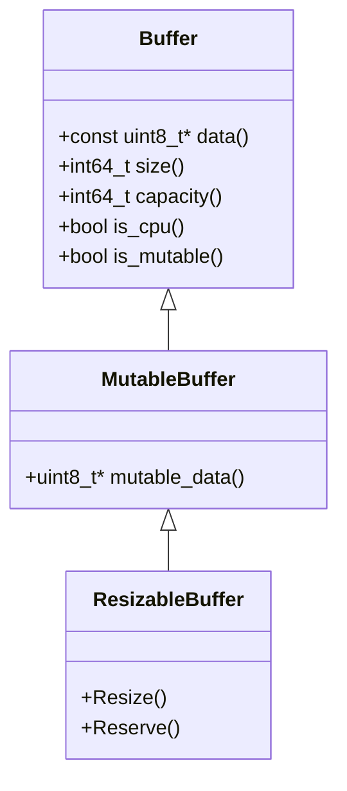
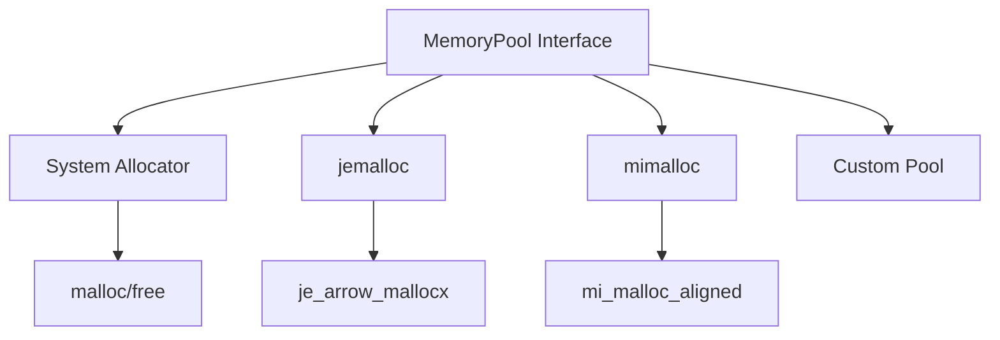
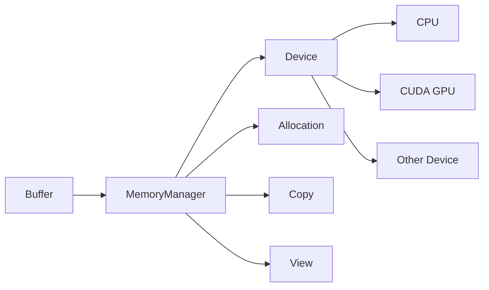

## Overview

Apache Arrow's memory management architecture is designed for high-performance zero-copy data interchange and efficient memory utilization. The system provides a layered approach with buffers, memory pools, and device-aware abstractions that support both CPU and GPU memory.

## Core Principles

The memory model is built on several key architectural decisions:

1. **64-byte alignment and padding** - All buffers are aligned to 64-byte boundaries for optimal SIMD operations
2. **Reference-counted ownership** - Memory lifetime is managed through shared pointers
3. **Zero-copy semantics** - Data can be shared and sliced without copying
4. **Device abstraction** - Unified interface for CPU and GPU memory

## Buffer Hierarchy

The buffer class hierarchy provides different levels of mutability and functionality:



### Buffer Class

The base `Buffer` class provides immutable access to a contiguous memory region:

```cpp
// From cpp/src/arrow/buffer.h
class Buffer {
 public:
  // Size vs Capacity: Size <= Capacity always holds
  int64_t size() const { return size_; }
  int64_t capacity() const { return capacity_; }
  
  // Access data (CPU buffers only)
  const uint8_t* data() const;
  
  // Device-agnostic address
  uintptr_t address() const;
  
  // Device awareness
  bool is_cpu() const { return is_cpu_; }
  bool is_mutable() const { return is_mutable_; }
  
 protected:
  const uint8_t* data_;
  int64_t size_;
  int64_t capacity_;
  bool is_cpu_;
  bool is_mutable_;
  std::shared_ptr<MemoryManager> memory_manager_;
  std::shared_ptr<Buffer> parent_;  // For slices
};
```

<Info>
Buffers maintain two length properties:
- **size**: The number of bytes containing valid data
- **capacity**: The total number of bytes allocated

This allows for efficient growth without reallocation.
</Info>

### Zero-Copy Slicing

Buffers support zero-copy slicing by maintaining a reference to a parent buffer:

```cpp
// Create a slice without copying memory
std::shared_ptr<Buffer> original = ...;
std::shared_ptr<Buffer> slice = SliceBuffer(original, offset, length);

// The slice keeps the parent alive
// Both point to the same underlying memory
```

This is implemented through parent buffer tracking:

```cpp
Buffer(std::shared_ptr<Buffer> parent, int64_t offset, int64_t size)
    : Buffer(parent->data_ + offset, size) {
  parent_ = std::move(parent);  // Keep parent alive
  SetMemoryManager(parent_->memory_manager_);
}
```

## Memory Pools

Memory pools abstract the underlying allocator and provide allocation tracking:



### MemoryPool Interface

```cpp
// From cpp/src/arrow/memory_pool.h
class MemoryPool {
 public:
  // Allocate aligned memory
  virtual Status Allocate(int64_t size, int64_t alignment, uint8_t** out) = 0;
  
  // Reallocate (may copy)
  virtual Status Reallocate(int64_t old_size, int64_t new_size, 
                           int64_t alignment, uint8_t** ptr) = 0;
  
  // Free memory
  virtual void Free(uint8_t* buffer, int64_t size, int64_t alignment) = 0;
  
  // Statistics
  virtual int64_t bytes_allocated() const = 0;
  virtual int64_t max_memory() const;
  virtual int64_t total_bytes_allocated() const = 0;
  virtual int64_t num_allocations() const = 0;
  
  virtual std::string backend_name() const = 0;
};
```

### Default Memory Pool Selection

The default pool is chosen at runtime:

1. **mimalloc** (if enabled at compile time) - High-performance allocator
2. **jemalloc** (if enabled at compile time) - Scalable concurrent allocator
3. **system malloc** - Fallback to standard C library

You can override this with the `ARROW_DEFAULT_MEMORY_POOL` environment variable.

<Note>
Memory pools are used for large, long-lived data like array buffers. Small C++ objects and temporary workspaces typically use standard C++ allocators.
</Note>

### Memory Statistics

Memory pools track allocation statistics with lock-free atomics:

```cpp
class MemoryPoolStats {
 private:
  std::atomic<int64_t> max_memory_{0};
  std::atomic<int64_t> bytes_allocated_{0};
  std::atomic<int64_t> total_allocated_bytes_{0};
  std::atomic<int64_t> num_allocs_{0};
  
 public:
  // Acquire-Release ordering for thread safety
  inline void DidAllocateBytes(int64_t size) {
    bytes_allocated_.fetch_add(size, std::memory_order_acq_rel);
    total_allocated_bytes_.fetch_add(size, std::memory_order_acq_rel);
    num_allocs_.fetch_add(1, std::memory_order_acq_rel);
    // Update max_memory with compare-exchange loop
  }
};
```

## Buffer Allocation

### Direct Allocation

Allocate buffers from a memory pool:

```cpp
// Allocate a fixed-size buffer (64-byte aligned and padded)
Result<std::unique_ptr<Buffer>> maybe_buffer = 
    AllocateBuffer(4096, pool);

if (!maybe_buffer.ok()) {
  // Handle allocation error
}

std::shared_ptr<Buffer> buffer = *std::move(maybe_buffer);
uint8_t* buffer_data = buffer->mutable_data();
memcpy(buffer_data, "hello world", 11);
```

### BufferBuilder

Incremental buffer construction:

```cpp
BufferBuilder builder;
builder.Resize(capacity);  // Reserve space
builder.Append("hello ", 6);
builder.Append("world", 5);

auto maybe_buffer = builder.Finish();
std::shared_ptr<Buffer> buffer = *maybe_buffer;
```

### TypedBufferBuilder

Type-safe buffer building:

```cpp
TypedBufferBuilder<int32_t> builder;
builder.Reserve(3);
builder.Append(0x12345678);
builder.Append(-0x76543210);
builder.Append(42);

auto buffer = *builder.Finish();
// buffer now contains three int32_t values
```

## Device-Aware Memory

Arrow supports heterogeneous memory through device abstractions:



### Device Abstraction

```cpp
// Query buffer device
if (buffer->is_cpu()) {
  // Can directly access data()
  const uint8_t* ptr = buffer->data();
} else {
  // Need to view or copy to CPU
  auto cpu_buffer = *Buffer::ViewOrCopy(
      buffer, default_cpu_memory_manager());
}
```

### Cross-Device Operations

```cpp
// Copy buffer to another device
Result<std::shared_ptr<Buffer>> Buffer::Copy(
    std::shared_ptr<Buffer> source,
    const std::shared_ptr<MemoryManager>& to);

// View buffer on another device (zero-copy if possible)
Result<std::shared_ptr<Buffer>> Buffer::View(
    std::shared_ptr<Buffer> source,
    const std::shared_ptr<MemoryManager>& to);

// View or copy as fallback
Result<std::shared_ptr<Buffer>> Buffer::ViewOrCopy(
    std::shared_ptr<Buffer> source,
    const std::shared_ptr<MemoryManager>& to);
```

<Info>
**Device Type vs. is_cpu()**: 
- `device_type()` returns the allocation type (kCPU, kCUDA, kCUDA_HOST, etc.)
- `is_cpu()` indicates whether the buffer is directly accessible from CPU code
- CUDA host memory has `device_type() == kCUDA_HOST` but `is_cpu() == true`
</Info>

## Memory Alignment and Padding

Arrow enforces strict alignment requirements for SIMD optimization:

```cpp
constexpr int64_t kDefaultBufferAlignment = 64;

// Buffers are allocated with:
// 1. Start address aligned to 64 bytes
// 2. Capacity rounded up to multiple of 64 bytes
// 3. Padding bytes between size and capacity zeroed

void Buffer::ZeroPadding() {
  if (capacity_ != 0) {
    memset(mutable_data() + size_, 0, 
           static_cast<size_t>(capacity_ - size_));
  }
}
```

<Note>
The 64-byte alignment ensures:
- Efficient SIMD operations (AVX-512 uses 64-byte vectors)
- Optimal cache line alignment
- Compliance with Arrow format specification
</Note>

## Advanced Usage

### Wrapping External Memory

```cpp
// Wrap external data without copying
std::vector<int32_t> external_data = {1, 2, 3, 4, 5};
std::shared_ptr<Buffer> buffer = Buffer::Wrap(external_data);
// WARNING: external_data must outlive buffer!

// To take ownership of a vector:
auto owned_buffer = Buffer::FromVector(std::move(external_data));
// external_data is now moved, buffer owns the data
```

### Memory Profiling

Arrow provides integration with Linux perf for detailed allocation profiling:

```bash
# Set up probes for jemalloc
perf probe -x libarrow.so je_arrow_mallocx '$params'
perf probe -x libarrow.so je_arrow_mallocx%return '$retval'
perf probe -x libarrow.so je_arrow_dallocx '$params'

# Record with tracebacks
perf record -g --call-graph dwarf \
  -e probe_libarrow:je_arrow_mallocx \
  -e probe_libarrow:je_arrow_mallocx__return \
  -e probe_libarrow:je_arrow_dallocx \
  ./my-arrow-application

# Analyze results
perf script | python3 process_perf_events.py > events.jsonl
```

### Custom Memory Pools

Implement custom allocation strategies:

```cpp
class MyCustomPool : public MemoryPool {
  Status Allocate(int64_t size, int64_t alignment, uint8_t** out) override {
    // Custom allocation logic
    *out = my_allocator(size, alignment);
    stats_.DidAllocateBytes(size);
    return Status::OK();
  }
  
  void Free(uint8_t* buffer, int64_t size, int64_t alignment) override {
    my_deallocator(buffer, size, alignment);
    stats_.DidFreeBytes(size);
  }
  
  std::string backend_name() const override { return "my_custom"; }
  
private:
  internal::MemoryPoolStats stats_;
};
```

## Architecture Decisions

### Why Two Length Fields?

<Note>
**Design Rationale**: Separate `size` and `capacity` fields enable efficient buffer growth patterns:

- **BufferBuilder** can reserve capacity upfront, then incrementally increase size as data is appended
- **Resizable buffers** can grow without frequent reallocations
- **Padding** bytes between size and capacity can be zeroed for security/correctness
</Note>

### Why Reference Counting?

Buffers use `std::shared_ptr` for automatic lifetime management:

- **Zero-copy slicing**: Multiple slices can reference the same underlying memory
- **Safe passing**: Buffers can be passed across API boundaries safely
- **Parent tracking**: Child buffers keep parent buffers alive
- **Thread-safe**: Reference counting works correctly across threads

### Why 64-byte Alignment?

- **SIMD performance**: AVX-512 operates on 64-byte vectors
- **Cache efficiency**: Aligned to cache line boundaries (typically 64 bytes)
- **Format compliance**: Arrow specification requires 64-byte alignment
- **Cross-platform**: Works well across different architectures

## Related Components

- **Arrays**: Build on buffers to provide typed access to data
- **Builders**: Use BufferBuilder internally to construct arrays
- **IPC**: Buffers enable zero-copy serialization/deserialization
- **Compute**: SIMD kernels rely on buffer alignment guarantees

## Further Reading

- [Arrow Format Specification - Memory Layout](https://arrow.apache.org/docs/format/Columnar.html)
- [Memory Management API Reference](/api/memory)
- [Arrays and Schemas](/arrays)