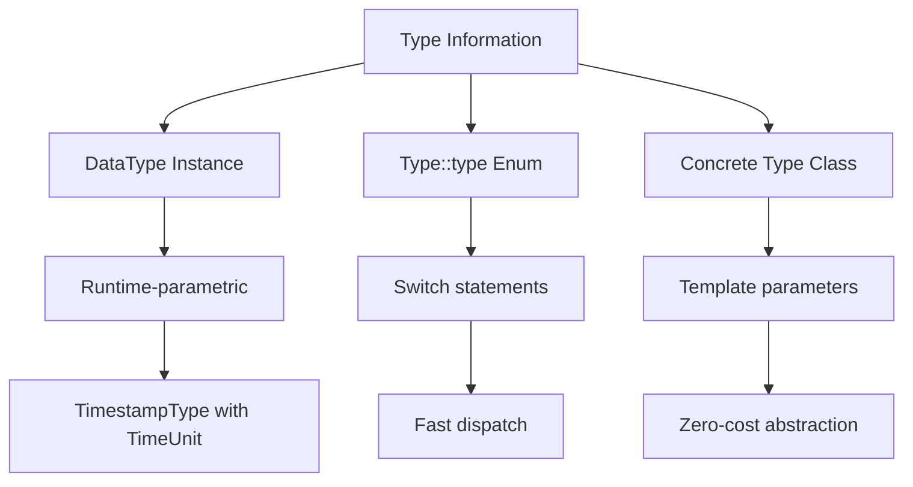
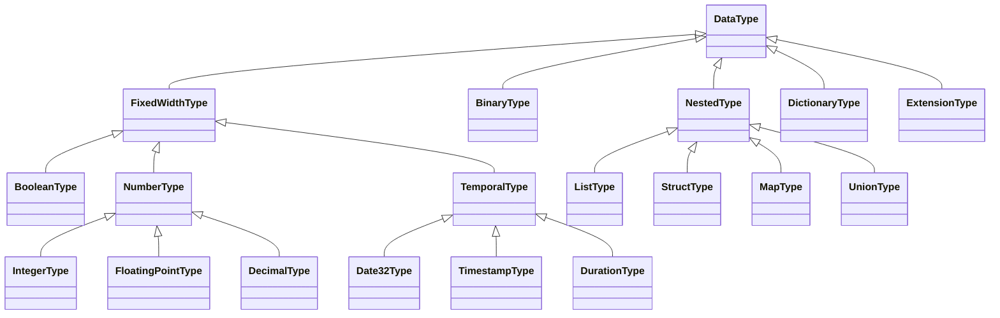

## Overview

Apache Arrow's type system provides a rich, hierarchical abstraction for representing data types across different programming languages and runtimes. The type system enables:

- **Binary interoperability** between different Arrow implementations
- **Zero-copy data sharing** across language boundaries (e.g., Python ↔ Java)
- **Compile-time and runtime polymorphism** through multiple representation forms
- **Type-safe generic programming** via type traits and template metaprogramming

## Type Representation Forms

Arrow types can be represented in three complementary ways:



### 1. DataType Instances (Runtime)

The most flexible form - a polymorphic instance representing any type:

```cpp
// From cpp/src/arrow/type.h
class DataType : public std::enable_shared_from_this<DataType> {
 public:
  explicit DataType(Type::type id);
  
  // Type identity and comparison
  Type::type id() const { return id_; }
  bool Equals(const DataType& other, bool check_metadata = false) const;
  
  // Type introspection
  virtual std::string ToString(bool show_metadata = false) const = 0;
  virtual std::string name() const = 0;
  
  // Physical layout
  virtual DataTypeLayout layout() const = 0;
  virtual int bit_width() const { return -1; }
  
  // Nested types
  const std::shared_ptr<Field>& field(int i) const;
  const FieldVector& fields() const { return children_; }
  int num_fields() const;
  
  // Visitor pattern
  Status Accept(TypeVisitor* visitor) const;
  
 protected:
  Type::type id_;
  FieldVector children_;  // For nested types
};
```

**Use cases**: Function arguments, polymorphic containers, dynamic type handling

```cpp
void ProcessData(const std::shared_ptr<DataType>& type) {
  // Works with any Arrow type at runtime
  if (type->id() == Type::TIMESTAMP) {
    auto ts_type = std::static_pointer_cast<TimestampType>(type);
    TimeUnit::type unit = ts_type->unit();
  }
}
```

### 2. Type::type Enum (Compile-Time)

A lightweight enum for efficient switching:

```cpp
enum class Type::type {
  NA,           // Null type
  BOOL,         // Boolean
  INT8, INT16, INT32, INT64,
  UINT8, UINT16, UINT32, UINT64,
  FLOAT, DOUBLE,
  STRING, BINARY,
  TIMESTAMP, DATE32, DATE64,
  LIST, STRUCT, MAP,
  // ... and more
};

// Usage in performance-critical code
switch (type->id()) {
  case Type::INT32:
    // Handle int32 case
    break;
  case Type::TIMESTAMP:
    // Handle timestamp case
    break;
  // ...
}
```

**Use cases**: Fast type dispatch, switch statements, non-polymorphic code

### 3. Concrete Type Classes (Template)

Type-specific classes for compile-time specialization:

```cpp
// Example concrete types
class Int32Type : public FixedWidthType {
  using c_type = int32_t;
  static constexpr Type::type type_id = Type::INT32;
  int bit_width() const override { return 32; }
};

class TimestampType : public FixedWidthType {
  using c_type = int64_t;
  
  TimestampType(TimeUnit::type unit, std::string timezone = "")
      : unit_(unit), timezone_(std::move(timezone)) {}
  
  TimeUnit::type unit() const { return unit_; }
  const std::string& timezone() const { return timezone_; }
  
private:
  TimeUnit::type unit_;
  std::string timezone_;
};
```

**Use cases**: Template parameters, type-specific optimizations, zero-cost abstractions

<Info>
The three forms complement each other:
- Use **DataType instances** for maximum flexibility
- Use **Type::type enum** for performance-critical dispatch
- Use **concrete classes** for compile-time type safety and optimization
</Info>

## Type Hierarchy



### Fixed-Width Types

Types with known, constant byte width:

```cpp
class FixedWidthType : public DataType {
 public:
  virtual int bit_width() const = 0;
  
  int32_t byte_width() const override {
    return bit_width() / 8;
  }
};

// Examples:
// - Boolean: 1 bit per value (packed)
// - Int32: 32 bits (4 bytes)
// - Timestamp: 64 bits (8 bytes)
// - Decimal128: 128 bits (16 bytes)
```

### Variable-Width Types

Types with dynamic size:

```cpp
// String and Binary types use offset buffers
// Layout: [validity bitmap] [offsets] [data]
//
// For element i: 
//   start = offsets[i]
//   end = offsets[i+1]
//   data = data_buffer[start:end]
```

### Nested Types

Types containing other types:

```cpp
// List<T>: Variable-length arrays of type T
std::shared_ptr<DataType> list_type = list(int32());

// Struct: Fixed set of named fields
std::shared_ptr<DataType> struct_type = struct_({
  field("x", float64()),
  field("y", float64()),
  field("label", utf8())
});

// Map<K,V>: Key-value pairs
std::shared_ptr<DataType> map_type = 
    map(utf8(), int32());
```

## Creating Types

Arrow provides factory functions for type creation:

```cpp
// Primitive types
auto int_type = int16();
auto float_type = float32();
auto bool_type = boolean();

// Parametric types
auto ts_type = timestamp(TimeUnit::MICRO, "UTC");
auto decimal_type = decimal128(/*precision=*/10, /*scale=*/2);
auto fixed_binary = fixed_size_binary(16);  // UUID

// Nested types
auto list_type = list(float32());
auto struct_type = struct_({
  field("id", int64()),
  field("name", utf8()),
  field("score", float64())
});

// Dictionary-encoded type
auto dict_type = dictionary(int32(), utf8());
```

<Note>
**Factory Functions**: Always use factory functions like `int32()`, `timestamp()`, etc. rather than constructing types directly. This ensures proper initialization and may return singleton instances for parameter-free types.
</Note>

## Type Traits

Type traits map Arrow types to associated C++ types:

```cpp
// From cpp/src/arrow/type_traits.h
template <typename T>
struct TypeTraits {};

// Example: BooleanType traits
template <>
struct TypeTraits<BooleanType> {
  using ArrayType = BooleanArray;
  using BuilderType = BooleanBuilder;
  using ScalarType = BooleanScalar;
  using CType = bool;
  
  static constexpr int64_t bytes_required(int64_t elements) {
    return bit_util::BytesForBits(elements);
  }
  
  constexpr static bool is_parameter_free = true;
  static inline std::shared_ptr<DataType> type_singleton() { 
    return boolean(); 
  }
};

// Example: Int32Type traits
template <>
struct TypeTraits<Int32Type> {
  using ArrayType = Int32Array;
  using BuilderType = Int32Builder;
  using ScalarType = Int32Scalar;
  using CType = int32_t;
  
  static constexpr int64_t bytes_required(int64_t elements) {
    return elements * sizeof(int32_t);
  }
  
  constexpr static bool is_parameter_free = true;
  static inline std::shared_ptr<DataType> type_singleton() { 
    return int32(); 
  }
};
```

### Using Type Traits

Write generic code that works across types:

```cpp
template <typename DataType>
auto MakeFibonacci(int32_t n) {
  // Type traits provide all associated types
  using BuilderType = typename TypeTraits<DataType>::BuilderType;
  using ArrayType = typename TypeTraits<DataType>::ArrayType;
  using CType = typename TypeTraits<DataType>::CType;
  
  BuilderType builder;
  CType val = 0;
  CType next_val = 1;
  
  for (int32_t i = 0; i < n; ++i) {
    builder.Append(val);
    CType temp = val + next_val;
    val = next_val;
    next_val = temp;
  }
  
  std::shared_ptr<ArrayType> out;
  ARROW_RETURN_NOT_OK(builder.Finish(&out));
  return out;
}

// Usage
auto fib_int = MakeFibonacci<Int32Type>(10);
auto fib_double = MakeFibonacci<DoubleType>(10);
```

### CType Traits

Reverse mapping from C++ types to Arrow types:

```cpp
template <>
struct CTypeTraits<int32_t> : public TypeTraits<Int32Type> {
  using ArrowType = Int32Type;
};

template <>
struct CTypeTraits<double> : public TypeTraits<DoubleType> {
  using ArrowType = DoubleType;
};

// Use in templates
template <typename CType>
using ArrowTypeFor = typename CTypeTraits<CType>::ArrowType;
```

## Type Predicates

Arrow provides type predicates for compile-time constraints:

```cpp
// Check if type is numeric
template <typename T>
using enable_if_number = 
    std::enable_if_t<is_number_type<T>::value, T>;

// Constrain function to numeric types only
template <typename ArrayType, 
          typename DataType = typename ArrayType::TypeClass,
          typename CType = typename DataType::c_type>
enable_if_number<DataType, CType> 
SumArray(const ArrayType& array) {
  CType sum = 0;
  for (std::optional<CType> value : array) {
    if (value.has_value()) {
      sum += value.value();
    }
  }
  return sum;
}

// Available predicates:
// - is_number_type
// - is_integer_type
// - is_floating_type
// - is_decimal_type
// - is_temporal_type
// - is_binary_like_type
// - is_nested_type
// - is_fixed_width_type
```

<Info>
Type predicates enable **SFINAE** (Substitution Failure Is Not An Error) for elegant function overloading based on type categories.
</Info>

## Visitor Pattern

The visitor pattern enables type-specific processing without runtime overhead:

```cpp
class TableSummation {
  double partial = 0.0;
  
public:
  Result<double> Compute(std::shared_ptr<RecordBatch> batch) {
    for (const auto& array : batch->columns()) {
      ARROW_RETURN_NOT_OK(VisitArrayInline(*array, this));
    }
    return partial;
  }
  
  // Default implementation
  Status Visit(const Array& array) {
    return Status::NotImplemented(
        "Cannot compute sum for array of type ",
        array.type()->ToString());
  }
  
  // Specialized implementation using type traits
  template <typename ArrayType, 
            typename T = typename ArrayType::TypeClass>
  enable_if_number<T, Status> Visit(const ArrayType& array) {
    for (std::optional<typename T::c_type> value : array) {
      if (value.has_value()) {
        partial += static_cast<double>(value.value());
      }
    }
    return Status::OK();
  }
};

// Usage
TableSummation summation;
auto result = summation.Compute(batch);
```

### Visitor Functions

Arrow provides three inline visitor functions:

```cpp
// Visit based on type
Status VisitTypeInline(const DataType& type, Visitor* visitor);

// Visit based on scalar
Status VisitScalarInline(const Scalar& scalar, Visitor* visitor);

// Visit based on array
Status VisitArrayInline(const Array& array, Visitor* visitor);
```

<Note>
**Inline vs. Virtual Visitors**: 
- `VisitTypeInline` uses template-based dispatch (can use template methods)
- `TypeVisitor::Accept()` uses virtual dispatch (requires virtual methods)
- Inline visitors are preferred for performance
</Note>

## DataTypeLayout

Types declare their physical buffer layout:

```cpp
struct DataTypeLayout {
  enum BufferKind {
    FIXED_WIDTH,    // Fixed bytes per element
    VARIABLE_WIDTH, // Variable-length data
    BITMAP,         // Packed bits
    ALWAYS_NULL     // Null type (no buffer)
  };
  
  struct BufferSpec {
    BufferKind kind;
    int64_t byte_width;  // For FIXED_WIDTH
  };
  
  std::vector<BufferSpec> buffers;
  bool has_dictionary = false;
  std::optional<BufferSpec> variadic_spec;  // For variable buffers
};

// Example layouts:

// Int32: [validity bitmap] [values]
DataTypeLayout {
  buffers = {Bitmap(), FixedWidth(4)},
  has_dictionary = false
}

// String: [validity bitmap] [offsets] [data]
DataTypeLayout {
  buffers = {Bitmap(), FixedWidth(4), VariableWidth()},
  has_dictionary = false
}

// List<T>: [validity bitmap] [offsets] [child buffers...]
DataTypeLayout {
  buffers = {Bitmap(), FixedWidth(4)},
  has_dictionary = false,
  variadic_spec = (child layout)
}
```

## Parametric Types

Some types require runtime parameters:

```cpp
// Timestamp with time unit and timezone
class TimestampType : public FixedWidthType {
public:
  TimestampType(TimeUnit::type unit, std::string timezone = "")
      : FixedWidthType(Type::TIMESTAMP),
        unit_(unit),
        timezone_(std::move(timezone)) {}
  
  TimeUnit::type unit() const { return unit_; }
  const std::string& timezone() const { return timezone_; }
  
  // Type equality considers parameters
  bool Equals(const DataType& other) const override {
    if (other.id() != Type::TIMESTAMP) return false;
    auto& other_ts = static_cast<const TimestampType&>(other);
    return unit_ == other_ts.unit_ && 
           timezone_ == other_ts.timezone_;
  }
  
private:
  TimeUnit::type unit_;        // SECOND, MILLI, MICRO, NANO
  std::string timezone_;       // Optional timezone
};

// Usage
auto ts_utc_micro = timestamp(TimeUnit::MICRO, "UTC");
auto ts_local_nano = timestamp(TimeUnit::NANO);  // No timezone
```

### Common Parametric Types

```cpp
// Decimal with precision and scale
auto money_type = decimal128(/*precision=*/10, /*scale=*/2);

// FixedSizeBinary with byte width
auto uuid_type = fixed_size_binary(16);

// FixedSizeList with size
auto vec3_type = fixed_size_list(float32(), /*size=*/3);

// Dictionary with index and value types
auto dict_type = dictionary(int16(), utf8());
```

## Extension Types

Custom types built on Arrow's type system:

```cpp
class ExtensionType : public DataType {
public:
  // Storage type (how data is physically stored)
  virtual std::shared_ptr<DataType> storage_type() const = 0;
  
  // Serialization for IPC
  virtual std::string Serialize() const = 0;
  virtual Result<std::shared_ptr<DataType>> Deserialize(
      std::shared_ptr<DataType> storage_type,
      const std::string& serialized) const = 0;
  
  // Extension name (must be unique)
  virtual std::string extension_name() const = 0;
};

// Example: UUID type stored as FixedSizeBinary(16)
class UuidType : public ExtensionType {
public:
  UuidType() : ExtensionType(Type::EXTENSION) {}
  
  std::shared_ptr<DataType> storage_type() const override {
    return fixed_size_binary(16);
  }
  
  std::string extension_name() const override {
    return "uuid";
  }
  
  std::string Serialize() const override { return ""; }
  // ...
};
```

## Type Fingerprinting

Types compute fingerprints for efficient comparison:

```cpp
class Fingerprintable {
public:
  // Full fingerprint (includes metadata)
  const std::string& fingerprint() const;
  
  // Metadata fingerprint only
  const std::string& metadata_fingerprint() const;
  
protected:
  virtual std::string ComputeFingerprint() const = 0;
  virtual std::string ComputeMetadataFingerprint() const = 0;
  
  // Lazy computation with atomic caching
  mutable std::atomic<std::string*> fingerprint_{nullptr};
  mutable std::atomic<std::string*> metadata_fingerprint_{nullptr};
};
```

Fingerprints enable:
- Fast type equality checks
- Type hashing for maps/sets
- Schema comparison
- Metadata-aware/agnostic comparisons

## Architecture Decisions

### Why Three Representation Forms?

<Note>
**Design Rationale**: The three forms provide optimal performance at different abstraction levels:

- **DataType instances**: Maximum flexibility, necessary for parametric types
- **Type::type enum**: Fast dispatch without virtual calls
- **Concrete classes**: Zero-cost abstractions via templates

This allows users to choose the right tradeoff for their use case.
</Note>

### Why Shared Pointers for Types?

Types are immutable and frequently shared:
- Multiple arrays can reference the same type
- Nested types share child types
- Type comparison is often pointer equality
- Thread-safe sharing across boundaries

### Why Parametric Types?

Some types need runtime configuration:
- Timestamps need time unit and timezone
- Decimals need precision and scale
- Fixed-size types need size parameter
- This cannot be expressed in the enum alone

## Related Components

- **Arrays**: Provide typed access to data based on types
- **Schemas**: Collections of fields with types
- **Compute**: Operations dispatch based on type
- **IPC**: Types are serialized for cross-process communication

## Further Reading

- [Type System API Reference](/api/datatype)
- [Arrays and Schemas](/arrays)
- [Compute Functions](/compute)