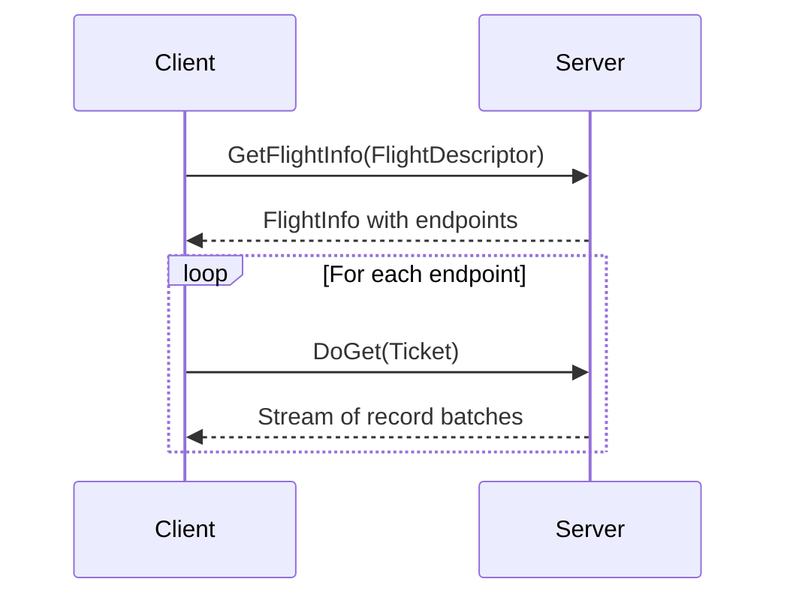
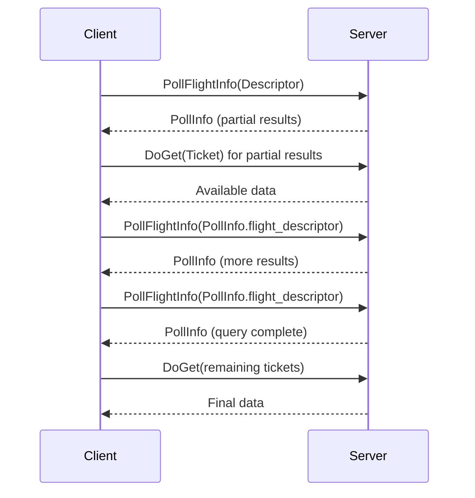
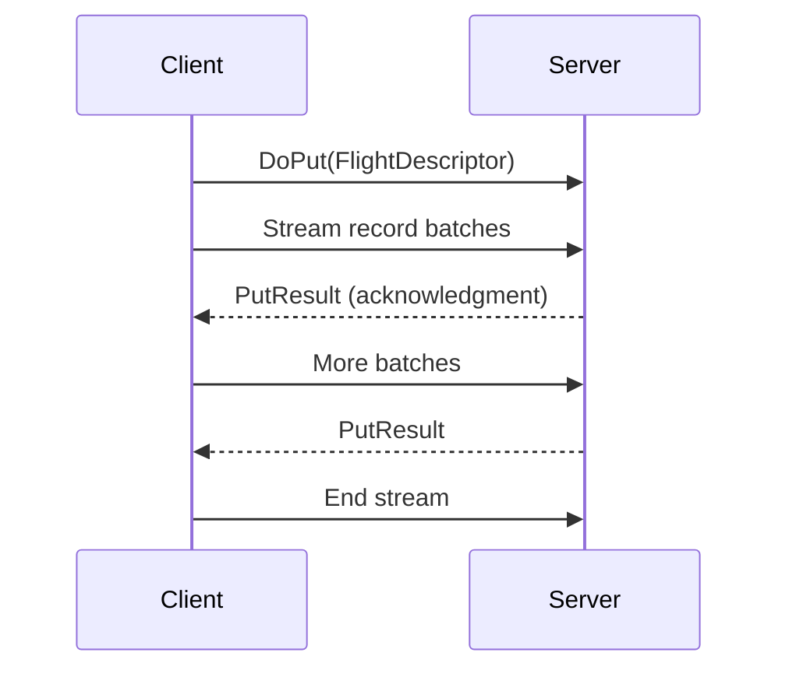
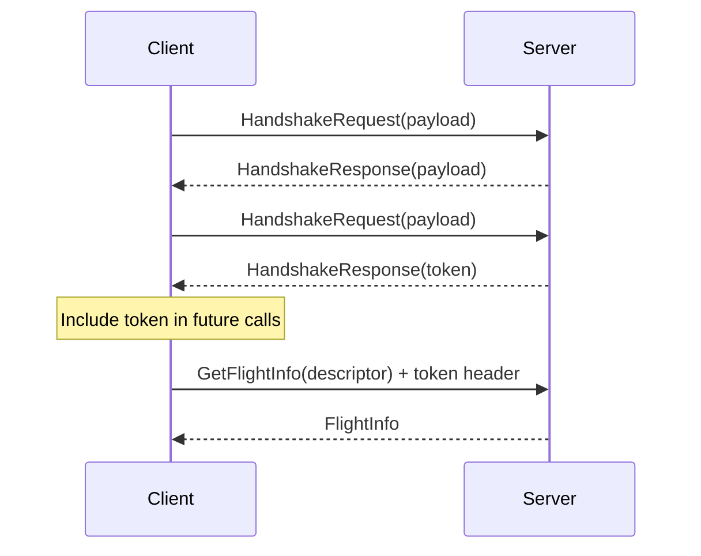

## Overview

**Arrow Flight** is an RPC framework for high-performance data services based on Arrow data. Flight is built on top of:

- **gRPC** - Modern RPC framework
- **Arrow IPC format** - Zero-copy data serialization
- **Protocol Buffers** - Service definitions

Flight organizes data exchange around streams of Arrow record batches that can be uploaded to or downloaded from services. A set of metadata methods provides discovery, introspection, and custom application operations.

<Note>
Flight implementations include optimizations to avoid Protocol Buffer overhead, primarily by minimizing memory copies during data transfer.
</Note>

## Key Concepts

### FlightDescriptor

Identifies a data stream using either:

**Path-based descriptor:**
```protobuf
FlightDescriptor {
  type: PATH
  path: ["database", "schema", "table"]
}
```

**Command-based descriptor:**
```protobuf
FlightDescriptor {
  type: CMD
  cmd: <binary SQL query or pickled object>
}
```

Applications can encode arbitrary information (SQL, file paths, serialized objects) in descriptors.

### FlightInfo

Metadata about a dataset:

```protobuf
message FlightInfo {
  bytes schema;                      // IPC schema
  FlightDescriptor flight_descriptor; // Original descriptor
  repeated FlightEndpoint endpoint;   // Data locations
  int64 total_records;               // -1 if unknown
  int64 total_bytes;                 // -1 if unknown
  bool ordered;                      // Endpoint ordering requirement
  bytes app_metadata;                // Application metadata
}
```

### FlightEndpoint

Location of a data partition:

```protobuf
message FlightEndpoint {
  Ticket ticket;                    // Opaque data identifier
  repeated Location location;       // Server addresses
  google.protobuf.Timestamp expiration_time;  // Optional expiry
  bytes app_metadata;               // Application metadata
}
```

<CardGroup cols={2}>
  <Card title="Ticket" icon="ticket">
    Opaque binary token identifying specific data
  </Card>
  <Card title="Location" icon="server">
    URI specifying server address and transport
  </Card>
</CardGroup>

## RPC Methods

Flight defines a core set of RPC methods:

### Metadata Methods

<AccordionGroup>
  <Accordion title="ListFlights">
    ```protobuf
    rpc ListFlights(Criteria) returns (stream FlightInfo) {}
    ```
    
    Discover available data streams:
    - Optional criteria for filtering
    - Returns stream of FlightInfo messages
    - Used for dataset discovery
  </Accordion>
  
  <Accordion title="GetFlightInfo">
    ```protobuf
    rpc GetFlightInfo(FlightDescriptor) returns (FlightInfo) {}
    ```
    
    Get metadata for specific dataset:
    - Blocks until query completes
    - Returns endpoints and schema
    - May generate new data streams
  </Accordion>
  
  <Accordion title="PollFlightInfo">
    ```protobuf
    rpc PollFlightInfo(FlightDescriptor) returns (PollInfo) {}
    ```
    
    Poll long-running query:
    - Non-blocking first response
    - Long-polling for updates
    - Incremental result availability
    - Progress reporting
  </Accordion>
  
  <Accordion title="GetSchema">
    ```protobuf
    rpc GetSchema(FlightDescriptor) returns (SchemaResult) {}
    ```
    
    Get schema without data:
    - Returns IPC-encoded schema
    - Lighter than GetFlightInfo
    - May generate new streams
  </Accordion>
</AccordionGroup>

### Data Transfer Methods

<AccordionGroup>
  <Accordion title="DoGet">
    ```protobuf
    rpc DoGet(Ticket) returns (stream FlightData) {}
    ```
    
    Download data stream:
    - Ticket from FlightEndpoint
    - Returns Arrow record batches
    - Server-to-client streaming
  </Accordion>
  
  <Accordion title="DoPut">
    ```protobuf
    rpc DoPut(stream FlightData) returns (stream PutResult) {}
    ```
    
    Upload data stream:
    - Client-to-server streaming
    - Bidirectional messaging
    - Server can send acknowledgments
  </Accordion>
  
  <Accordion title="DoExchange">
    ```protobuf
    rpc DoExchange(stream FlightData) returns (stream FlightData) {}
    ```
    
    Bidirectional data exchange:
    - Simultaneous upload and download
    - Stateful computations
    - Transform operations
  </Accordion>
</AccordionGroup>

### Action Methods

<AccordionGroup>
  <Accordion title="DoAction">
    ```protobuf
    rpc DoAction(Action) returns (stream Result) {}
    ```
    
    Execute custom actions:
    - Application-specific operations
    - Opaque request/response
    - Example: `CancelFlightInfo`, `RenewFlightEndpoint`
  </Accordion>
  
  <Accordion title="ListActions">
    ```protobuf
    rpc ListActions(Empty) returns (stream ActionType) {}
    ```
    
    Discover available actions:
    - Returns action names and descriptions
    - Enables capability discovery
  </Accordion>
</AccordionGroup>

### Authentication

```protobuf
rpc Handshake(stream HandshakeRequest) 
    returns (stream HandshakeResponse) {}
```

Bidirectional handshake for authentication.

## Request Patterns

### Downloading Data

Standard workflow for retrieving data:



**Steps:**

1. **Acquire FlightDescriptor** (from discovery or known descriptor)
2. **Call GetFlightInfo** to get data locations
3. **Connect to endpoints** and call DoGet with ticket
4. **Consume record batches** from each endpoint

<Note>
Clients may consume endpoints in parallel or distribute them across multiple machines for horizontal scaling.
</Note>

### Ordered vs. Unordered Data

**Ordered Data** (`FlightInfo.ordered = true`):
```text
Data must be concatenated in endpoint order:
  Endpoint 0: [batch0, batch1, batch2]
  Endpoint 1: [batch3, batch4]
  Endpoint 2: [batch5, batch6, batch7]

Result: [batch0, batch1, batch2, batch3, batch4, batch5, batch6, batch7]
```

**Unordered Data** (`FlightInfo.ordered = false`):
```text
Endpoints may be consumed in any order:
  Parallel fetches allowed
  Data from endpoints may be interleaved
  Data within endpoint must remain ordered
```

<Warning>
Some clients may ignore `FlightInfo.ordered`. For strict ordering guarantees, return a single endpoint.
</Warning>

### Long-Running Queries

Use `PollFlightInfo` for queries with long execution times:



**PollInfo Structure:**

```protobuf
message PollInfo {
  FlightInfo info;                   // Current results (complete, not delta)
  FlightDescriptor flight_descriptor; // Next poll descriptor (unset if complete)
  optional double progress;          // [0.0, 1.0] if known
  google.protobuf.Timestamp expiration_time;
}
```

**Server Behavior:**
- First response should be immediate
- Subsequent calls block until new results (long polling)
- Only append to endpoints (no removal/reordering)
- Set `progress` if available (not required to be monotonic)

**Client Behavior:**
- Can fetch partial results before query completes
- Should use descriptor from PollInfo for next poll
- Can set short timeout to avoid blocking
- Query complete when `flight_descriptor` is unset

### Uploading Data



**Use Cases:**
- Data ingestion
- Resumable writes (via PutResult messages)
- Bulk uploads

### Data Exchange

`DoExchange` enables stateful, bidirectional operations:

```text
Example: Distributed Sort
  Client uploads unsorted data →
  ← Server streams sorted partitions
  
Example: Iterative Algorithm
  Client sends parameters →
  ← Server returns results
  Client sends updated parameters →
  ← Server returns refined results
```

## Location URIs

Flight supports multiple transports via URI schemes:

| Transport | URI Scheme | Example |
|-----------|------------|----------|
| gRPC (plaintext) | `grpc:` or `grpc+tcp:` | `grpc://hostname:8080` |
| gRPC (TLS) | `grpc+tls:` | `grpc+tls://hostname:8443` |
| gRPC (Unix socket) | `grpc+unix:` | `grpc+unix:///tmp/flight.sock` |
| Connection reuse | `arrow-flight-reuse-connection:` | `arrow-flight-reuse-connection://?` |
| HTTP/HTTPS | `http:` or `https:` | `https://hostname/data.arrow` |

### Connection Reuse

Special URI for servers to indicate reuse of existing connection:

```protobuf
FlightEndpoint {
  ticket: <data identifier>
  location: ["arrow-flight-reuse-connection://?"]
}
```

**Benefits:**
- Server doesn't need to know its public address
- Useful for port forwarding scenarios
- Simplifies deployment configurations

<Note>
The URI must be exactly `arrow-flight-reuse-connection://?` with trailing `/?` for compatibility across Java, C++, Go, and Python URI parsers.
</Note>

### Extended Location URIs

Servers can return HTTP(S) URLs for direct data access:

```protobuf
FlightEndpoint {
  ticket: <ignored>
  location: ["https://s3.amazonaws.com/bucket/data.arrow?signature=..."]
}
```

**Use Cases:**
- Presigned S3/GCS URLs
- CDN-hosted data
- HTTP file servers
- Cached Parquet files

**Client Behavior:**
- Perform HTTP GET request
- Assume Arrow IPC format unless `Content-Type` indicates otherwise
- Support for `Accept` header negotiation (optional)

**Supported Content Types:**
- `application/octet-stream` - Assume Arrow IPC
- `application/vnd.apache.arrow.stream` - Arrow IPC stream
- `application/vnd.apache.arrow.file` - Arrow IPC file
- Other types (e.g., Parquet) per server capabilities

## Authentication

Flight supports multiple authentication patterns:

### Handshake Authentication



**Implementation Options:**

1. **Stateful "login" pattern:**
   - Establish trust during handshake
   - Don't validate token on each call
   - ⚠️ Not secure with Layer 7 load balancers

2. **Stateless token validation:**
   - Handshake may be skipped
   - Include externally acquired token (e.g., OAuth bearer)
   - Validate on every call

<Warning>
Handshake-based authentication without per-call validation is insecure with gRPC load balancers or transparent reconnections.
</Warning>

### Header-Based Authentication

Custom middleware validates headers:

```text
Client includes authentication header:
  Authorization: Bearer <token>
  X-Custom-Auth: <credentials>

Server middleware:
  - Validates headers
  - Accepts or rejects call
  - May extract user context
```

### Mutual TLS (mTLS)

Client certificate authentication:

```text
TLS handshake:
  Server requests client certificate
  Client provides certificate
  Server validates certificate
  Connection established

No application code needed (handled by gRPC)
```

**Requirements:**
- TLS must be enabled
- Certificate provisioning and distribution
- May not be available in all implementations

### gRPC Authentication

Flight implementations may expose underlying gRPC authentication:
- OAuth2
- JWT tokens  
- Custom authenticators
- Channel credentials

Refer to [gRPC authentication guide](https://grpc.io/docs/guides/auth/).

## Error Handling

Flight defines standard error codes:

| Error Code | Description |
|------------|-------------|
| `UNKNOWN` | Unknown error (default) |
| `INTERNAL` | Internal service error |
| `INVALID_ARGUMENT` | Client passed invalid argument |
| `TIMED_OUT` | Operation exceeded timeout |
| `NOT_FOUND` | Requested resource not found |
| `ALREADY_EXISTS` | Resource already exists |
| `CANCELLED` | Operation cancelled (client or server) |
| `UNAUTHENTICATED` | Client not authenticated |
| `UNAUTHORIZED` | Client lacks permissions |
| `UNIMPLEMENTED` | RPC method not implemented |
| `UNAVAILABLE` | Server unavailable (connectivity issues) |

**Usage:**

```python
# Pseudocode
try:
    info = client.get_flight_info(descriptor)
except FlightUnauthenticatedError:
    # Authenticate and retry
    token = authenticate()
    client.set_token(token)
    info = client.get_flight_info(descriptor)
except FlightNotFoundError:
    # Handle missing data
    print(f"Dataset {descriptor} not found")
```

## Standard Actions

Flight defines standard actions for common operations:

### CancelFlightInfo

```protobuf
message CancelFlightInfoRequest {
  FlightInfo info;
}

enum CancelStatus {
  CANCEL_STATUS_UNSPECIFIED = 0;
  CANCEL_STATUS_CANCELLED = 1;    // Cancellation complete
  CANCEL_STATUS_CANCELLING = 2;   // In progress
  CANCEL_STATUS_NOT_CANCELLABLE = 3;
}
```

**Usage:**
```text
Client calls: DoAction("CancelFlightInfo", CancelFlightInfoRequest)
Server returns: CancelFlightInfoResult with status
```

### RenewFlightEndpoint

```protobuf
message RenewFlightEndpointRequest {
  FlightEndpoint endpoint;
}
```

**Usage:** Extend expiration time of short-lived endpoints

## Performance Considerations

### Zero-Copy Transfers

Flight optimizes Protocol Buffer usage:
- Metadata in Protobuf
- Data in Arrow IPC format
- Minimal copies during serialization/deserialization

### Parallel Endpoint Consumption

```text
Linear:     [E0] → [E1] → [E2] → [E3]
Parallel:   [E0]
            [E1]  (all simultaneously)
            [E2]
            [E3]

Distributed: E0 → Worker1
             E1 → Worker2
             E2 → Worker3  
             E3 → Worker4
```

### Compression

Use Arrow IPC compression for data transfer:
- LZ4 for low latency
- ZSTD for better compression ratios
- Consider network bandwidth vs. CPU trade-off

### Batching

Optimize batch size:
- Too small: overhead dominates
- Too large: memory pressure
- Sweet spot: typically 10K-100K rows

## Protocol Buffer Definitions

Full service definition from `Flight.proto`:

```protobuf
service FlightService {
  rpc Handshake(stream HandshakeRequest) 
      returns (stream HandshakeResponse) {}
  
  rpc ListFlights(Criteria) 
      returns (stream FlightInfo) {}
  
  rpc GetFlightInfo(FlightDescriptor) 
      returns (FlightInfo) {}
  
  rpc PollFlightInfo(FlightDescriptor) 
      returns (PollInfo) {}
  
  rpc GetSchema(FlightDescriptor) 
      returns (SchemaResult) {}
  
  rpc DoGet(Ticket) 
      returns (stream FlightData) {}
  
  rpc DoPut(stream FlightData) 
      returns (stream PutResult) {}
  
  rpc DoExchange(stream FlightData) 
      returns (stream FlightData) {}
  
  rpc DoAction(Action) 
      returns (stream Result) {}
  
  rpc ListActions(Empty) 
      returns (stream ActionType) {}
}
```

## Implementation Examples

### Server Example

```python
class MyFlightServer(FlightServerBase):
    def get_flight_info(self, context, descriptor):
        # Parse descriptor
        if descriptor.type == FlightDescriptor.PATH:
            table_name = descriptor.path[0]
        else:
            query = descriptor.cmd.decode('utf-8')
            table_name = parse_query(query)
        
        # Get schema
        schema = get_table_schema(table_name)
        
        # Create endpoints (one per partition)
        endpoints = []
        for partition in get_partitions(table_name):
            ticket = Ticket(partition.encode('utf-8'))
            location = Location.for_grpc_tcp('localhost', 8080)
            endpoints.append(FlightEndpoint(ticket, [location]))
        
        return FlightInfo(
            schema=schema,
            descriptor=descriptor,
            endpoints=endpoints,
            total_records=count_records(table_name),
            total_bytes=-1
        )
    
    def do_get(self, context, ticket):
        partition = ticket.ticket.decode('utf-8')
        reader = get_partition_reader(partition)
        return FlightDataStream(reader)
```

### Client Example

```python
client = FlightClient('grpc://localhost:8080')

# Get flight info
descriptor = FlightDescriptor.for_path('my_table')
flight_info = client.get_flight_info(descriptor)

print(f"Schema: {flight_info.schema}")
print(f"Records: {flight_info.total_records}")

# Fetch data from all endpoints
all_batches = []
for endpoint in flight_info.endpoints:
    reader = client.do_get(endpoint.ticket)
    batches = list(reader)
    all_batches.extend(batches)

# Combine into table
table = pa.Table.from_batches(all_batches)
```

## Best Practices

<AccordionGroup>
  <Accordion title="Service Design">
    - Define clear descriptor semantics
    - Document available actions
    - Implement meaningful error messages
    - Use appropriate authentication method
    - Version your service interface
  </Accordion>
  
  <Accordion title="Performance">
    - Optimize batch sizes for your use case
    - Use compression judiciously
    - Exploit parallel endpoint consumption
    - Consider data locality in endpoints
    - Profile and measure bottlenecks
  </Accordion>
  
  <Accordion title="Reliability">
    - Implement timeout handling
    - Use PollFlightInfo for long queries
    - Set appropriate expiration times
    - Support cancellation
    - Handle network failures gracefully
  </Accordion>
  
  <Accordion title="Security">
    - Always use TLS in production
    - Validate tokens on every call
    - Implement proper authorization
    - Audit access to sensitive data
    - Use presigned URLs for object storage
  </Accordion>
</AccordionGroup>

## Resources

- [Arrow Flight Documentation](https://arrow.apache.org/docs/format/Flight.html)
- [Flight.proto](https://github.com/apache/arrow/blob/main/format/Flight.proto)
- [Introducing Arrow Flight](https://arrow.apache.org/blog/2019/10/13/introducing-arrow-flight/)
- [gRPC Documentation](https://grpc.io/docs/)
